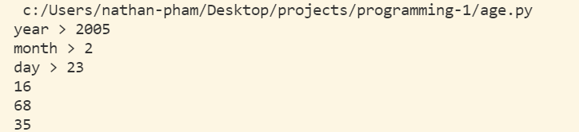
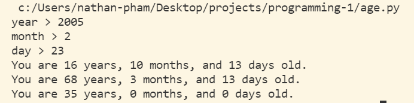
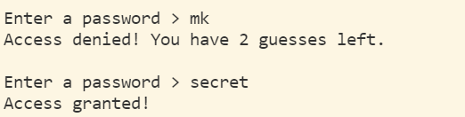
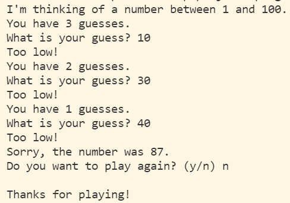

# Programming 1
Del Oro High School Programming 1 class

## Units
* [If Statements](if_statement.py)
* [If Else Or](if_else_or.py)
* [Calculating Age](age.py)
* [While Loop](while_loop.py)
* [Guessing Game](guessing_game.py)
* [Rock Paper Scissors](rock_paper_scissors.py)
* [For Loop](for_loop.py)
* [Reverse For Loop](reverse_for_loop.py)
* [Modulus](modulus.py)
* [Strings](strings.py)

## Helping Students
* [Discord Bot](discord_bot.py)
* [Rubber Band Experiment](rubberbands_experiment/rubberbands.py)

## Screenshots

